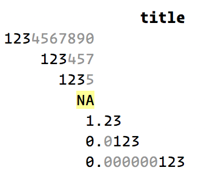

---
output:
  github_document:
    html_preview: false
---

<!-- README.md is generated from README.Rmd. Please edit that file -->

```{r, echo = FALSE}
knitr::opts_chunk$set(
  collapse = TRUE,
  comment = "#>",
  fig.path = "README-"
)
```

# pillar

[](https://travis-ci.org/r-lib/pillar)

pillar provides tools for styling columns of data, artfully using colour and unicode characters to 

## Installation

```{r, eval = FALSE}
# install.packages("devtools")
devtools::install_github("hadley/pillar")
```

## Usage

pillar is not designed for end-users but will eventually be incorporated in packages like [tibble](http://tibble.tidyverse.org).

```{r}
library(pillar)

x <- 123456789 * (10 ^ c(1, -3, -5, NA, -8, -10))
pillar(x)
```

If you render this in a console that supports colour, you'll see something that looks like this:

```{r, echo = FALSE, out.width = "200px"}

```


## Extending

The primary user of this package is [tibble](https://github.com/tidyverse/tibble), which in the current development version already lets pillar do all the formatting work.  Packages that implement a data type to be used in a tibble column can add color with only a few changes:

1. Implement the `pillar_shaft()` method for your data type.
1. Add pillar to `Suggests` and implement dynamic method registration
    - If you don't mind the dependency, you can also add it to `Imports`, and import the methods you override with a regular `NAMESPACE` import.

[tidyverse/hms#43](https://github.com/tidyverse/hms/pull/43) shows the changes that were necessary to add colored output for the hms package:

- [`pillar.R`](https://github.com/tidyverse/hms/pull/43/files#diff-a63dd6b1da682a8549d03475ac91cdcf) for the actual implementation (old name `colformat.R`)
- [`DESCRIPTION`](https://github.com/tidyverse/hms/pull/43/files#diff-35ba4a2677442e210c23a00a5601aba3) for the dependency
- [`zzz.R`](https://github.com/tidyverse/hms/pull/43/files#diff-e549505eb95036528ca3b125f62915a6) for the dynamic method registration

Some more detail is given below.

### Implementing `pillar_shaft.your_class_name()`

This method accepts a vector of arbitrary length and is expected to return an S3 object with the following properties:

- It has an attribute `"width"`
- It can have an attribute `"min_width"`, if missing, `"width"` is used
- It must implement a method `format(x, width, ...)` that can be called with any value between `min_width` and `width`
    - This method must return an object that inherits from `character` and has attributes `"align"` (with supported values `"left"`, `"right"`, and `"center"`) and `"width"`

The function `new_pillar_shaft()` returns such an object, and also correctly formats `NA` values.  In many cases, the implementation of `pillar_shaft.your_class_name()` will format the data as a character vector (using color for emphasis) and simply call `new_pillar_shaft()`.  See `pillar_shaft.numeric()` for a code that allows changing the display depending on the available width.

### Useful helpers

- `style_neg()` to format negative values
- `style_num()` to format numbers
- `style_subtle()` to de-emphasize


### Dynamic method registration

If you avoid the strong dependency on pillar, you need a helper, `register_s3_method()`, which you can borrow e.g. from hms. In `.onLoad()`, call this helper as follows:

```r
register_s3_method("pillar", "pillar_shaft", "your_class_name")
```

Replace `"your_class_name"` with the name of the S3 class of your data type.


## Inspirations

* [TextPlots](https://github.com/sunetos/TextPlots.jl) for use of Braille 
  characters
  
* [spark](https://github.com/holman/spark) for use of block characters.

The earliest use of unicode characters to generate sparklines appears to be [from 2009](https://blog.jonudell.net/2009/01/13/fuel-prices-and-pageviews/).

Exercising these ideas to their fullest requires a font with good support for block drawing characters. [PragamataPro](https://www.fsd.it/shop/fonts/pragmatapro/) is one such font.
